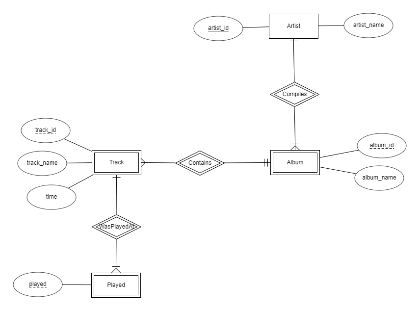

# BasicSQL
I will be using a a music collection to make a database that I found online. I have used an online https://erdplus.com/ platform to make an ER Diagram for the Music Database. The ER model for this diagram is shown below.
   

fig: Music ER Diagram

 
Lets begin by creating the database for the Music Database.

